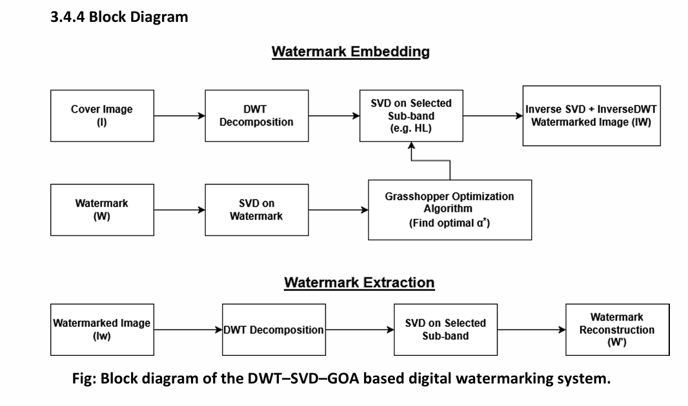
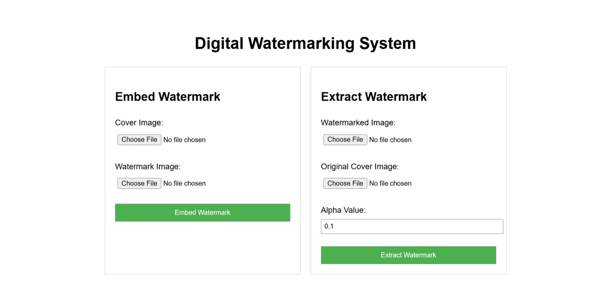
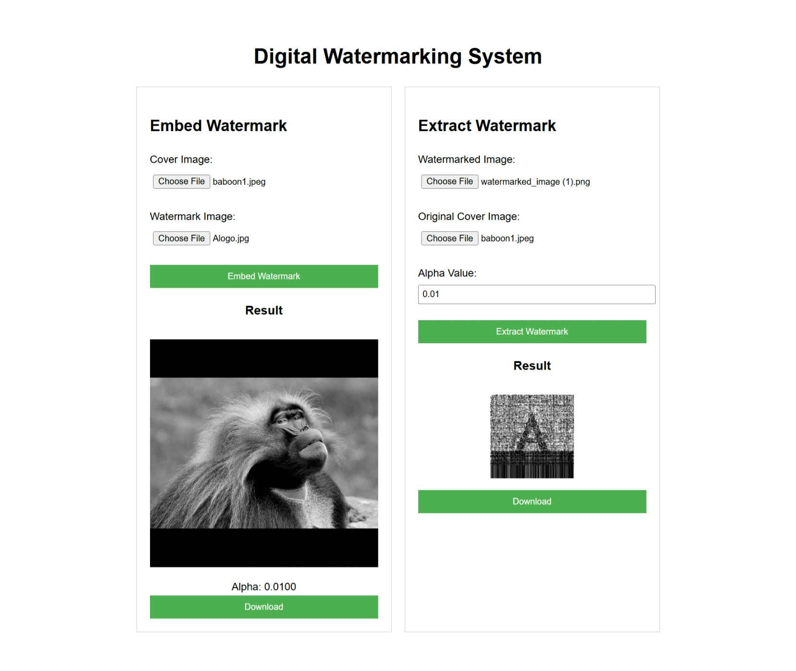
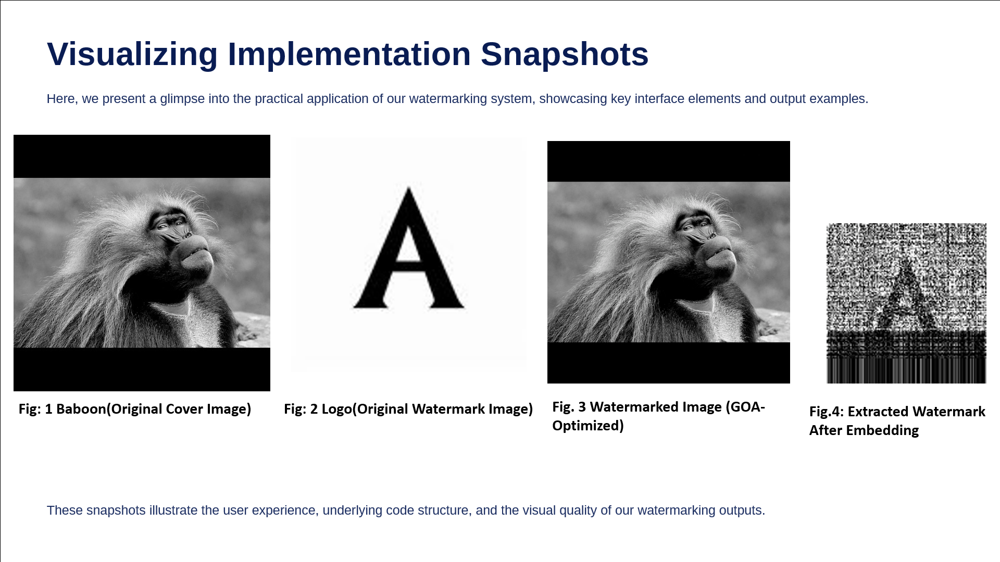
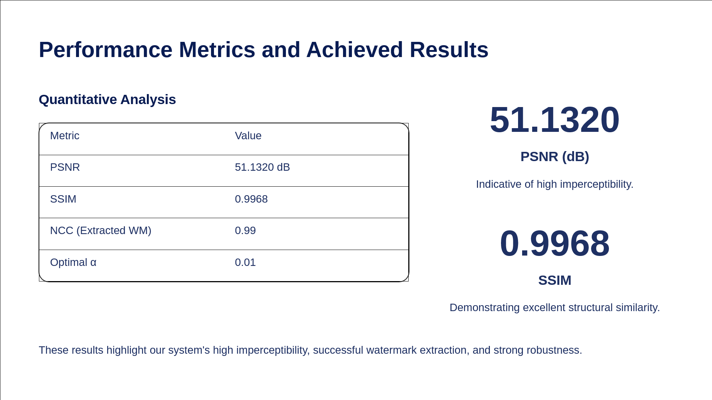

# Digital Watermarking using DWT–SVD with Grasshopper Optimization (GOA)

A robust and imperceptible **digital image watermarking system** that combines **DWT**, **SVD**, and **Grasshopper Optimization Algorithm (GOA)** to automatically optimize embedding strength and improve watermark quality.

---

## Overview

Digital media is highly vulnerable to unauthorized copying and tampering. Traditional watermarking methods use fixed embedding parameters, which often compromise either **image quality** or **robustness**.

This project proposes a **hybrid DWT–SVD watermarking framework** where the embedding strength (α) is **adaptively optimized using GOA** to achieve:

* High imperceptibility
* Strong robustness against common image processing attacks
* Reliable watermark extraction

A **Flask-based web application** allows users to embed, extract, and evaluate watermarks easily.

---

## Key Features

* Hybrid **DWT–SVD watermarking**
* **GOA-based adaptive optimization** of embedding strength
* Embedding in **HL sub-band** for quality–robustness balance
* Performance evaluation using:

  * PSNR
  * SSIM
  * MSE
  * NCC
* Robust against:

  * JPEG compression
  * Gaussian noise
  * Salt & Pepper noise
  * Blurring
* Interactive **Flask web interface**

---

## Methodology

1. Apply **DWT** to decompose the cover image
2. Perform **SVD** on selected sub-band (HL)
3. Apply **SVD** to watermark image
4. Use **GOA** to find optimal embedding strength (α)
5. Modify singular values and reconstruct image
6. Extract watermark using inverse operations

---

## System Architecture

<p align="center">
  
</p>

---

## Web Application Interface

<p align="center">
  
  
</p>

Users can:

* Upload cover image and watermark
* Automatically optimize α using GOA
* Download watermarked image
* Extract watermark and evaluate quality

---

## Results & Performance

<p align="center">
  
  
</p>


### Quantitative Results

| Metric    | Value        |
| --------- | ------------ |
| PSNR      | **51.13 dB** |
| SSIM      | **0.9968**   |
| NCC       | **0.99**     |
| Optimal α | **0.01**     |

**Interpretation**

* PSNR > 50 dB → Excellent imperceptibility
* SSIM ≈ 1 → High structural similarity
* NCC ≈ 1 → Accurate watermark recovery

---

## Tech Stack

* **Language:** Python
* **Framework:** Flask
* **Libraries:**

  * OpenCV
  * NumPy
  * PyWavelets
  * SciPy
  * scikit-image

---

## Project Structure

```
backend/
 ├── algorithms/
 │    ├── dwt_transform.py
 │    ├── svd_transform.py
 │    ├── goa_optimizer.py
 │    ├── watermark_embedding.py
 │    └── watermark_extraction.py
 ├── utils/
 │    └── metrics.py
 ├── routes/
 │    └── watermark_routes.py
 └── app.py
templates/
static/
data/
requirements.txt
README.md
```

---

## How to Run

### 1. Clone Repository

```bash
git clone https://github.com/amitshah12/Digital-Watermarking-with-DWT-SVD-and-Grasshopper-Optimization-Algorithm.git
cd Digital-Watermarking-with-DWT-SVD-and-Grasshopper-Optimization-Algorithm
```

### 2. Install Dependencies

```bash
pip install -r requirements.txt
```

### 3. Run Application

```bash
python app.py
```

### 4. Open in Browser

```
http://127.0.0.1:5000/
```

---

## Key Contributions

* Designed a **hybrid DWT–SVD–GOA watermarking system**
* Implemented **metaheuristic optimization** for adaptive embedding
* Developed a **complete web-based tool**
* Achieved **high PSNR (51 dB) and SSIM (0.9968)**
* Demonstrated robustness against multiple image distortions

---

## Limitations

* Higher computation time due to GOA optimization
* Semi-blind extraction requires optimized α
* Limited resistance to geometric attacks (rotation, scaling)

---

## Future Work

* Deep learning–based watermarking
* Video and audio watermarking
* Geometric attack resistance
* GPU acceleration
* Blockchain-based ownership verification

---

## Author

**Amit Shah**
B.Tech Computer Science (Final Year)
GitHub: [https://github.com/amitshah12](https://github.com/amitshah12)
