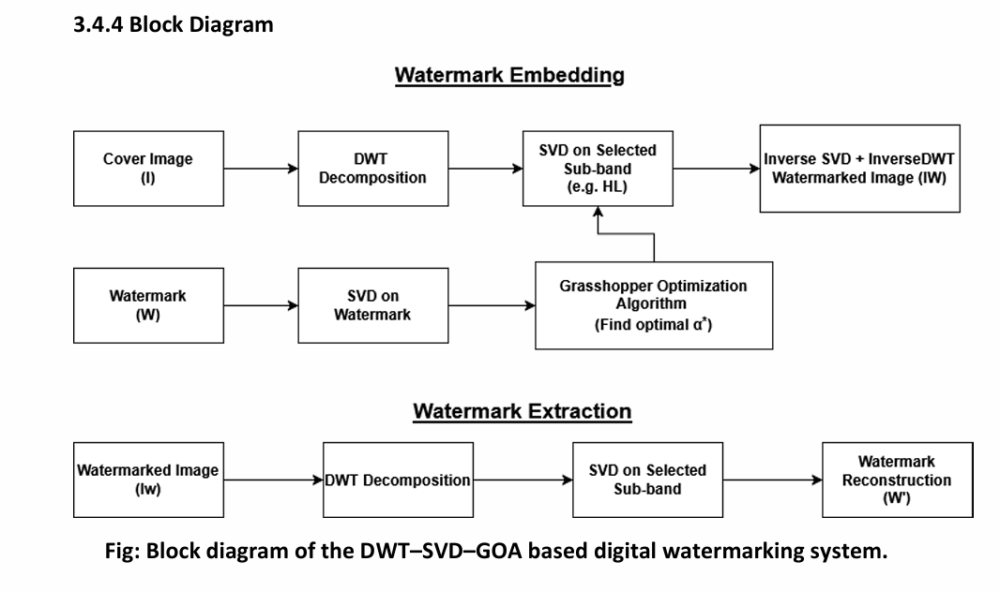
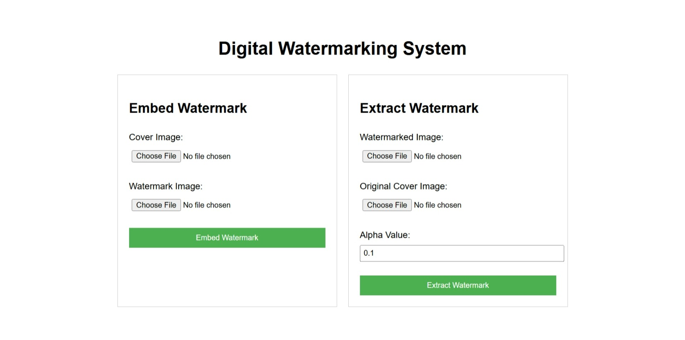
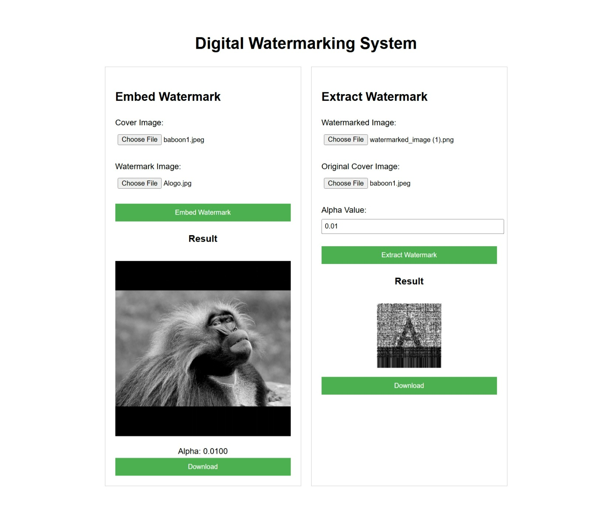
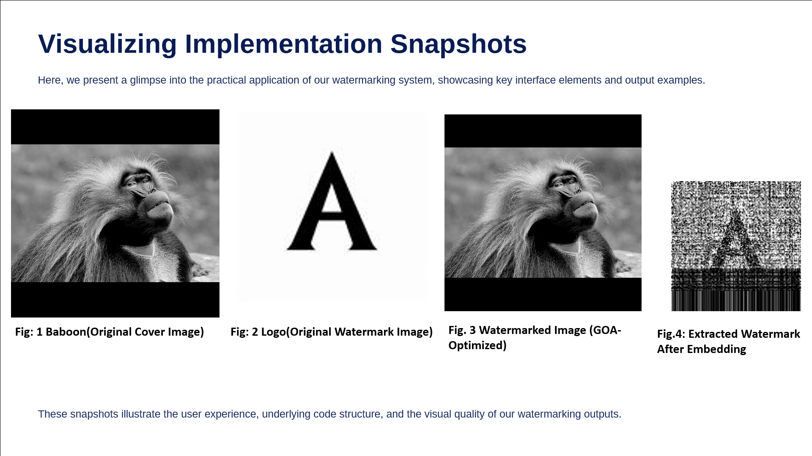
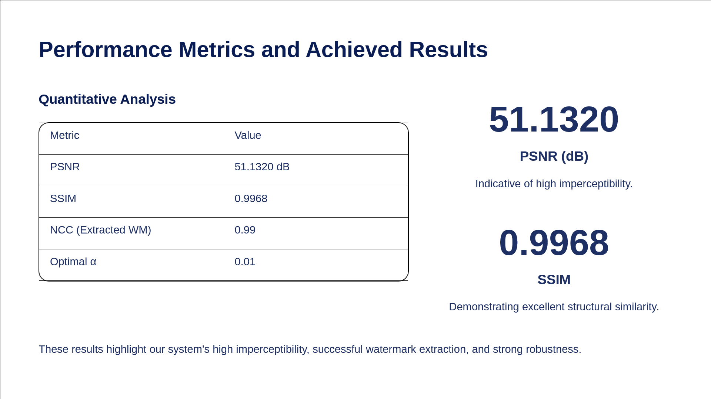

# Digital Watermarking using DWT–SVD and Grasshopper Optimization Algorithm

[](https://www.python.org/)
[](https://flask.palletsprojects.com/)
[](https://opencv.org/)

A web-based **digital image watermarking system** that combines **Discrete Wavelet Transform (DWT)**, **Singular Value Decomposition (SVD)**, and the **Grasshopper Optimization Algorithm (GOA)** to embed and extract digital watermarks while maintaining high image quality.

The system uses GOA to optimize the watermark embedding strength automatically and provides an interactive Flask-based web interface for watermark embedding, extraction, and performance evaluation.

---

## 🌐 Live Demo

🚀 Live Application: [https://digital-watermarking-goa.onrender.com/](https://digital-watermarking-goa.onrender.com/)

The application is deployed using **Render** and can be accessed directly through the link above.
---

## 📂 Project Repository

🔗 **GitHub Repository:**  
[Digital Watermarking with DWT–SVD and Grasshopper Optimization Algorithm](https://github.com/amitshah12/Digital-Watermarking-with-DWT-SVD-and-Grasshopper-Optimization-Algorithm)

---

# 📌 Overview

Digital images are highly vulnerable to unauthorized copying, redistribution, and tampering. Digital watermarking provides a method for embedding ownership or authentication information directly into an image.

Traditional watermarking approaches often rely on a fixed embedding strength. Choosing a value that is too high can visibly distort the image, while choosing a value that is too low may make the watermark difficult to recover.

This project implements a hybrid **DWT–SVD–GOA watermarking framework**, where the embedding strength **α (alpha)** is optimized automatically.

The main objectives are:

- High imperceptibility of the watermark
- Reliable watermark extraction
- Adaptive embedding strength optimization
- Robustness against common image processing operations
- A simple web-based interface for practical use

---

# ✨ Key Features

- Hybrid **DWT–SVD watermarking**
- **Grasshopper Optimization Algorithm (GOA)** for adaptive alpha optimization
- Automatic embedding strength selection
- Watermark embedding and extraction
- Downloadable watermarked image
- Downloadable extracted watermark
- Image quality evaluation using:
  - PSNR
  - SSIM
  - MSE
  - NCC
- Robustness evaluation against common image processing attacks:
  - JPEG compression
  - Gaussian noise
  - Salt & Pepper noise
  - Blurring
- Interactive **Flask web interface**
- Cloud deployment support using **Render**

---

# 🧠 Methodology

The watermarking process follows the steps below.

### 1. Image Preprocessing

The cover image and watermark image are validated and converted into grayscale format when necessary.

### 2. Discrete Wavelet Transform (DWT)

The cover image is decomposed into frequency sub-bands using DWT.

This separates the image into approximation and detail components.

### 3. Singular Value Decomposition (SVD)

SVD is applied to the selected DWT component.

The singular values are modified to embed the watermark information.

### 4. Grasshopper Optimization Algorithm (GOA)

GOA searches for a suitable embedding strength **α**.

The optimization balances:

- Watermark embedding strength
- Image quality
- Imperceptibility

### 5. Watermark Embedding

The optimized alpha value is used to modify the singular values.

The modified component is reconstructed using inverse SVD and inverse DWT to generate the final watermarked image.

### 6. Watermark Extraction

The watermark is extracted using the original cover image, watermarked image, and embedding strength.

---

# 🏗️ System Architecture

<p align="center">
  
</p>

The overall pipeline can be represented as:

```text
Cover Image
     │
     ▼
   DWT
     │
     ▼
Selected Frequency Component
     │
     ▼
   SVD
     │
     ├─────────────── Watermark
     │
     ▼
GOA Optimizes Alpha (α)
     │
     ▼
Modify Singular Values
     │
     ▼
Inverse SVD
     │
     ▼
Inverse DWT
     │
     ▼
Watermarked Image
````

---

# 🖥️ Web Application Interface

<p align="center">
  
  
</p>

The web application allows users to:

* Upload a cover image
* Upload a watermark image
* Automatically optimize the embedding strength using GOA
* Generate a watermarked image
* View the optimized alpha value
* Download the watermarked image
* Upload the original and watermarked images
* Extract the embedded watermark
* Download the extracted watermark

---

# 📊 Results and Performance

<p align="center">
  
  
</p>

## Quantitative Results

The following results were obtained from a representative experiment using the selected cover image, watermark, and optimized embedding strength.

| Metric    |        Value |
| --------- | -----------: |
| PSNR      | **51.13 dB** |
| SSIM      |   **0.9968** |
| NCC       |     **0.99** |
| Optimal α |     **0.01** |

## Interpretation

* **PSNR > 50 dB** indicates that the watermarked image maintains high visual similarity with the original image.
* **SSIM close to 1** indicates strong structural similarity.
* **NCC close to 1** indicates a high correlation between the original watermark and extracted watermark.
* The optimized alpha value helps balance watermark strength and image quality.

> Results may vary depending on the cover image, watermark image, and optimization process.

---

# 🛠️ Tech Stack

## Programming Language

* Python

## Backend Framework

* Flask

## Libraries

* NumPy
* OpenCV
* PyWavelets
* SciPy
* scikit-image

## Deployment

* Render

---

# 🧪 Tested Environment

| Component    | Version  |
| ------------ | -------- |
| Python       | 3.12.10  |
| Flask        | 2.3.3    |
| NumPy        | 1.26.4   |
| OpenCV       | 4.8.1.78 |
| PyWavelets   | 1.9.0    |
| scikit-image | 0.22.0   |
| Werkzeug     | 2.3.7    |

> **Recommended Python version:** Python 3.12 (64-bit)

Some scientific computing dependencies may not be compatible with newer Python versions depending on the versions specified in `requirements.txt`.

---

# 📁 Project Structure

```text
Digital-Watermarking-with-DWT-SVD-and-Grasshopper-Optimization-Algorithm/
│
├── backend/
│   │
│   ├── algorithms/
│   │   ├── dwt_transform.py
│   │   ├── svd_transform.py
│   │   ├── goa_optimizer.py
│   │   ├── watermark_embedding.py
│   │   └── watermark_extraction.py
│   │
│   ├── utils/
│   │   └── metrics.py
│   │
│   ├── routes/
│   │   └── watermark_routes.py
│   │
│   └── app.py
│
├── templates/
│   └── index.html
│
├── static/
│
├── data/
│   └── sample_images/
│
├── Project_Screenshot/
│   ├── block_diagram.png
│   ├── UI.jpeg
│   ├── UI-in_out.jpeg
│   ├── Result_view.png
│   └── metric.png
│
├── requirements.txt
├── setup.py
├── README.md
└── .gitignore
```

---

# 🚀 Getting Started

## 1. Clone the Repository

```bash
git clone https://github.com/amitshah12/Digital-Watermarking-with-DWT-SVD-and-Grasshopper-Optimization-Algorithm.git
```

Move into the project directory:

```bash
cd Digital-Watermarking-with-DWT-SVD-and-Grasshopper-Optimization-Algorithm
```

---

## 2. Create and Activate a Virtual Environment

Make sure Python 3.12 is installed.

### Windows

Create a virtual environment:

```bash
py -3.12 -m venv venv
```

Activate it:

```bash
venv\Scripts\activate
```

Verify the Python version:

```bash
python --version
```

Expected output:

```text
Python 3.12.x
```

You can also verify that Python is running in 64-bit mode:

```bash
python -c "import platform; print(platform.architecture())"
```

Expected output:

```text
('64bit', 'WindowsPE')
```

### Linux/macOS

Create the environment:

```bash
python3.12 -m venv venv
```

Activate it:

```bash
source venv/bin/activate
```

---

## 3. Upgrade pip

Before installing the dependencies:

```bash
python -m pip install --upgrade pip setuptools wheel
```

---

## 4. Install Dependencies

Install all required packages:

```bash
pip install -r requirements.txt
```

Optional verification:

```bash
pip list
```

---

## 5. Run the Application Locally

The Flask application entry point is located inside the `backend` directory.

```bash
cd backend
```

Run:

```bash
python app.py
```

The application will typically start at:

```text
http://127.0.0.1:5000/
```

Open the address in your browser.

---

# 🌐 Using the Application

## Embed a Watermark

1. Upload a cover image.
2. Upload a watermark image.
3. Click **Embed Watermark**.
4. The system automatically runs the optimization process.
5. A watermarked image is generated.
6. The alpha value used for embedding is displayed.
7. Download the watermarked image if required.

## Extract a Watermark

1. Upload the watermarked image.
2. Upload the original cover image.
3. Enter or use the corresponding alpha value.
4. Click **Extract Watermark**.
5. The extracted watermark will be displayed.
6. Download the extracted watermark if required.

---

# 📈 Performance Metrics

The project uses the following metrics to evaluate watermarking quality.

## PSNR — Peak Signal-to-Noise Ratio

Measures the similarity between the original and watermarked images.

Higher values generally indicate lower visible distortion.

## SSIM — Structural Similarity Index

Measures structural similarity between images.

A value close to `1` indicates high similarity.

## MSE — Mean Squared Error

Measures the average squared difference between pixel values.

Lower values indicate lower distortion.

## NCC — Normalized Cross-Correlation

Measures similarity between the original watermark and extracted watermark.

A value close to `1` indicates strong watermark recovery.

---

# ⚠️ Troubleshooting

## NumPy or PyWavelets Installation Fails

First check your Python version:

```bash
python --version
```

Check the Python architecture:

```bash
python -c "import platform; print(platform.architecture())"
```

Recommended environment:

```text
Python 3.12.x
64-bit
```

If you previously created a virtual environment using another Python version, recreate it.

### Windows

Deactivate the existing environment:

```bash
deactivate
```

Delete the existing virtual environment:

```bash
rmdir /s /q venv
```

Create a new environment:

```bash
py -3.12 -m venv venv
```

Activate it:

```bash
venv\Scripts\activate
```

Upgrade pip:

```bash
python -m pip install --upgrade pip setuptools wheel
```

Install dependencies again:

```bash
pip install -r requirements.txt
```

---

# 🧩 Key Contributions

* Designed a hybrid **DWT–SVD–GOA digital watermarking system**
* Implemented adaptive watermark embedding strength optimization
* Reduced optimization overhead for improved web deployment performance
* Developed a complete Flask-based web application
* Implemented watermark embedding and extraction functionality
* Added image quality evaluation using PSNR, SSIM, MSE, and NCC
* Achieved high image quality in representative experiments
* Deployed the application for online access

---

# ⚠️ Limitations

* GOA-based optimization can still increase processing time for large images.
* Watermark extraction depends on the corresponding embedding strength alpha.
* The current approach has limited resistance to some geometric attacks such as:

  * Rotation
  * Scaling
  * Cropping
* Results can vary depending on the selected cover and watermark images.

---

# 🔮 Future Improvements

Possible future enhancements include:

* Deep learning-based watermarking
* Blind watermark extraction
* Video watermarking
* Audio watermarking
* Improved resistance to geometric attacks
* GPU acceleration
* Adaptive multi-objective optimization
* Blockchain-based ownership verification
* User authentication and watermark history
* REST API support for external applications

---

# 🤝 Contributing

Contributions, suggestions, and improvements are welcome.

To contribute:

1. Fork the repository.
2. Create a new branch:

```bash
git checkout -b feature-name
```

3. Make your changes.
4. Commit the changes:

```bash
git commit -m "Add new feature"
```

5. Push the branch:

```bash
git push origin feature-name
```

6. Create a Pull Request.

---

# 👨‍💻 Author

**Amit Shah**

GitHub:
[https://github.com/amitshah12](https://github.com/amitshah12)

Project Repository:
[https://github.com/amitshah12/Digital-Watermarking-with-DWT-SVD-and-Grasshopper-Optimization-Algorithm](https://github.com/amitshah12/Digital-Watermarking-with-DWT-SVD-and-Grasshopper-Optimization-Algorithm)

Live Demo:
[https://digital-watermarking-goa.onrender.com/](https://digital-watermarking-goa.onrender.com/)

---
⭐ If you find the project interesting, consider giving the repository a star.
````
